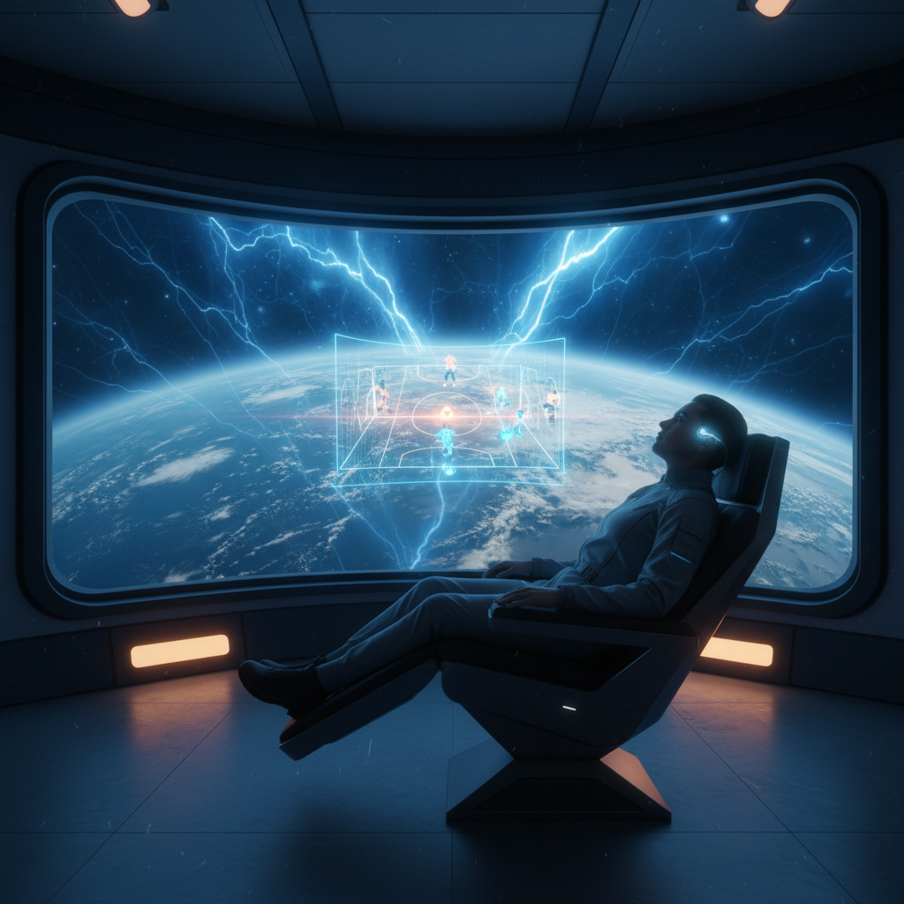

# 비가 내리지 않는 도시 — 2387년 5월 30일의 기록

오늘 저녁, 나는 카이라를 만나기로 되어 있었다.

궤도 정거장 '하버-260'의 7번 전망 데크. 지구가 발밑으로 천천히 돌아가는 그곳에서, 우리는 합성 커피를 마시며 옛 영화 이야기를 나눌 예정이었다. 나는 사흘 전부터 그 약속을 위해 가장 좋은 보온 슈트를 점검해 두었고, 셔틀 좌석도 미리 예약해 두었다.

그런데 출발 두 시간 전, 거주 모듈의 벽면 전체가 붉게 깜빡이기 시작했다.

『기상 통제 시스템 경보 — 상층부 이온 폭풍 발생. 모든 셔틀 운항 중단.』

지구에서는 그걸 그냥 '비'라고 불렀다고 한다. 옛 기록 속의 비. 하지만 이 도시의 하늘에는 물 대신 전하를 띤 입자들이 쏟아진다. 돔의 외피가 푸르게 타오르며 폭풍을 막아내는 동안, 셔틀 항로는 모두 닫혔다. 카이라에게서 메시지가 도착했다.

『미안해. 다음에 보자. 폭풍이 잦아들면 연락할게.』

나는 한참 동안 텅 빈 전망창을 바라보았다. 만나지 못한 저녁이라는 건, 시대가 아무리 바뀌어도 똑같이 허전한 모양이다.

결국 나는 거주 모듈로 돌아왔다. 조명을 낮추고, 의자에 몸을 묻고, 관자놀이에 뉴럴 인터페이스를 가볍게 붙였다.

「오비탈 리그 결승. 무중력 축구.」

천장이 사라지고, 눈앞에 거대한 구형 경기장이 펼쳐졌다. 사방이 골대인 무중력 공간 안에서, 선수들은 벽을 차고 날아오르며 빛나는 공을 주고받았다. 관중들의 함성이 모듈 안을 가득 채웠다. 나는 혼자였지만, 그 순간만큼은 수백만 명과 같은 장면을 보고 있었다.

밖에서는 이온 폭풍이 여전히 도시의 돔을 두드리고 있었다. 안에서는 무중력 공이 별처럼 떠다녔다.

약속은 무산되었고, 비는 — 아니, 폭풍은 — 멈추지 않았지만,
혼자 보낸 이 저녁도 그리 나쁘지만은 않았다.

폭풍이 잦아들면, 카이라에게 먼저 연락해야겠다.
