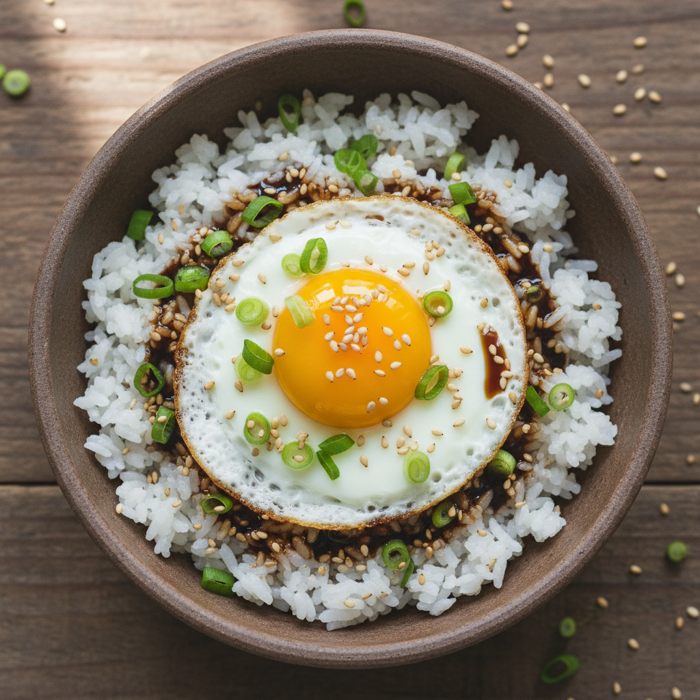

# 간장계란밥

따뜻한 밥에 계란후라이와 간장, 참기름만 있으면 완성되는 초간단 저녁 메뉴입니다.

## 조리 정보
- 분량: 1인분
- 조리 시간: 약 10분
- 난이도: 매우 쉬움

## 재료
- 따뜻한 밥 1공기
- 계란 2개
- 진간장 1큰술
- 참기름 1작은술
- 식용유 1큰술
- 깨소금 약간
- 쪽파(또는 김가루) 약간

## 조리 순서
1. 팬에 식용유를 두르고 중불로 달군다.
2. 계란을 깨뜨려 넣고 노른자가 반숙이 되도록 후라이를 만든다.
3. 그릇에 따뜻한 밥을 담는다.
4. 밥 위에 계란후라이를 올린다.
5. 진간장 1큰술과 참기름 1작은술을 골고루 뿌린다.
6. 깨소금과 쪽파(또는 김가루)를 뿌려 마무리한다.
7. 노른자를 터뜨려 밥과 비벼 먹는다.

## 팁
- 간장은 한 번에 다 넣지 말고 간을 보며 조절하세요.
- 버터 한 조각을 추가하면 더 고소한 풍미를 낼 수 있습니다.
- 계란을 완숙으로 익히면 비비기 편하고, 반숙으로 하면 부드럽게 즐길 수 있습니다.
