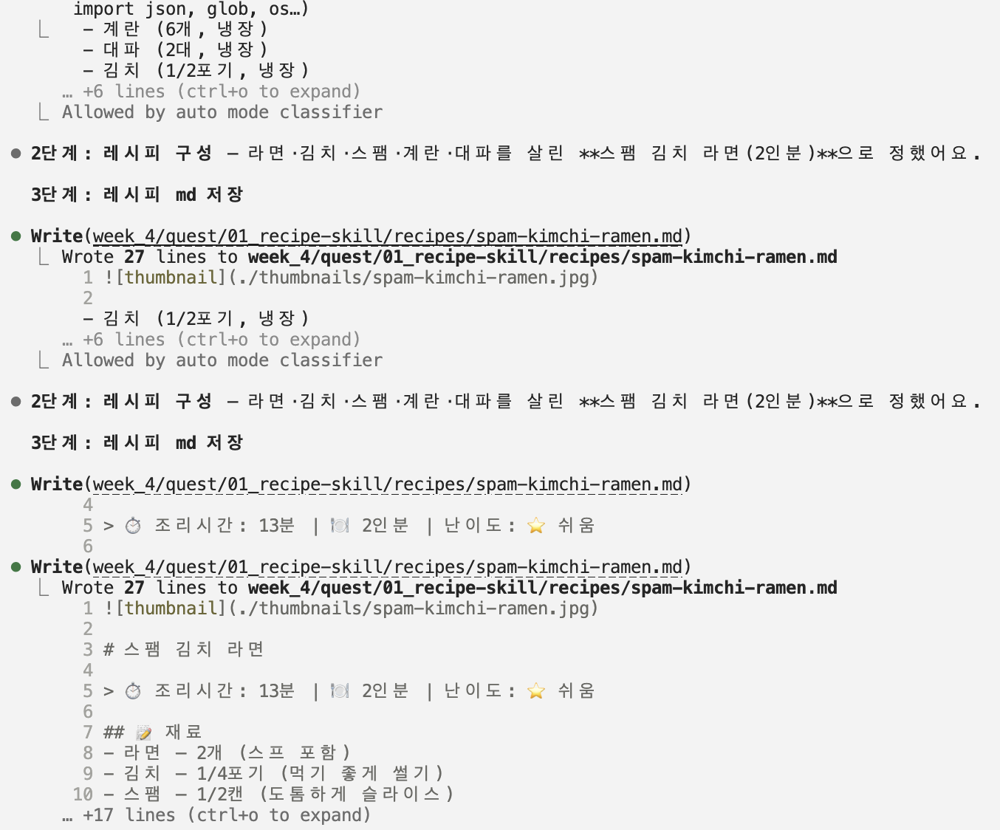
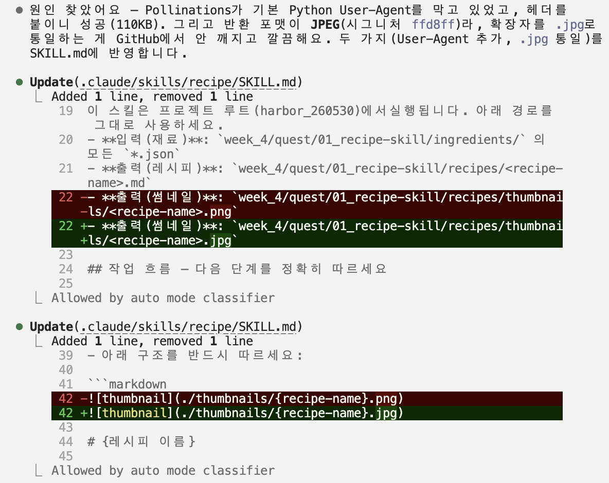

# Q1 — 냉장고 재료 기반 레시피 제작 Skill

하버스쿨 4주차 퀘스트 1. **"파일 = 가장 단순한 저장소"**를 체감하는 미션.
냉장고 재료를 **재료당 JSON 파일 1개**로 관리하고, `/recipe` 스킬이 그 폴더를 읽어
**2인분 / 15분 / 자취생 난이도** 레시피를 만들어 마크다운으로 저장한다.

```
[재료별 JSON 작성] → [/recipe 실행] → [ingredients/ 전체 읽기] → [레시피 생성] → [md 저장]
```

## 폴더 구조

```
week_4/quest/01_recipe-skill/
├── ingredients/          # 재료 JSON (재료 1개 = 파일 1개)
│   ├── egg.json
│   ├── kimchi.json
│   ├── green-onion.json
│   ├── ramen.json
│   ├── spam.json
│   └── rice.json
├── recipes/              # /recipe 실행 결과(.md)가 저장되는 곳
│   └── thumbnails/       # 썸네일 png 저장 위치
└── README.md

.claude/skills/recipe/SKILL.md   # 스킬 본문 (/recipe 로 호출)
```

재료 JSON 형식:

```json
{ "name": "계란", "quantity": "6개", "category": "냉장" }
```

## 사용법

1. **프로젝트 루트(harbor_260530)** 에서 Claude Code 실행
2. `/recipe` 입력 (또는 "냉장고 재료로 뭐 해먹지?" 처럼 자연어로 요청)
3. 스킬이 `ingredients/`의 JSON을 모두 읽어 레시피를 만들고 `recipes/`에 `.md`로 저장

## 재료 추가/삭제 (코드 수정 없음)

- **추가**: `ingredients/`에 JSON 파일 1개를 새로 만든다 (예: `tofu.json`)
- **삭제**: 해당 JSON 파일을 지운다

스킬 코드는 건드릴 필요가 없다 — 재료는 항상 폴더에서 다시 읽기 때문.

## 썸네일

썸네일은 Pollinations(무료 이미지 생성)로 만든다 — **API 키도 결제도 필요 없다.**
`/recipe` 실행 시 `recipes/thumbnails/<name>.png` 가 자동 생성된다.

네트워크 오류 등으로 생성이 실패해도 **레시피 본문(.md)은 정상 생성**된다.
다른 제공자(Gemini·Cloudflare 등)로 바꾸려면 `SKILL.md`의 4단계 블록만 교체하면 된다.

## 제출물 (마감: 금요일 23:59)

- [x] GitHub repo 링크 (Skill 코드 + JSON 포함)
- [x] 생성된 레시피 md 2개 (`recipes/spam-kimchi-fried-rice.md`, `recipes/spam-kimchi-ramen.md`)
- [x] `/recipe` 실행 화면 스크린샷 (아래)
- [x] (포인트) 에이전트와 2회 이상 대화하며 개선한 흔적 (아래)

### `/recipe` 실행 화면

`/recipe` 입력 → `ingredients/`의 JSON을 모두 읽고 → 2인분 레시피를 구성해
`recipes/`에 마크다운으로 저장하는 실행 흐름.



### 에이전트 대화 캡처

에이전트와 대화하며 썸네일을 Gemini → **Pollinations(무료, API 키 불필요)** 로 전환하고,
반환 포맷(JPEG)에 맞춰 `SKILL.md`를 `.jpg`로 수정한 개선 과정.


