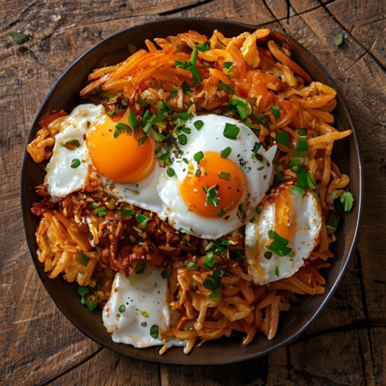

# 스팸 김치볶음밥

> ⏱️ 조리시간: 12분 | 🍽️ 2인분 | 난이도: ⭐ 쉬움

## 📝 재료
- 밥 — 2공기
- 김치 — 1/2포기 (한 줌 반, 송송 썰기)
- 스팸 — 1/2캔 (깍둑썰기)
- 대파 — 1대 (송송 썰기)
- 계란 — 2개 (후라이용)
- 식용유 — 1.5큰술
- 간장 — 1작은술
- 설탕 — 1/2작은술
- 후추 — 약간

## 👨‍🍳 만드는 법
1. 팬에 식용유 1큰술을 두르고 대파를 넣어 30초간 볶아 파기름을 냅니다.
2. 깍둑썬 스팸을 넣고 가장자리가 노릇해질 때까지 2분간 볶습니다.
3. 송송 썬 김치와 설탕 1/2작은술을 넣고 2분간 더 볶아 신맛을 날립니다.
4. 밥 2공기를 넣고 주걱으로 김치·스팸과 고루 섞으며 3분간 볶습니다.
5. 간장 1작은술을 팬 가장자리에 둘러 살짝 태우듯 풍미를 낸 뒤 후추를 뿌려 마무리합니다.
6. 같은 팬 한쪽(또는 빈 자리)에 남은 기름으로 계란 후라이 2개를 부쳐 볶음밥 위에 올립니다.

## 💡 꿀팁
- 팬 하나로 파기름 → 볶음밥 → 계란까지 끝내면 설거지가 팬 1개로 줄어요.
- 김치가 덜 익었으면 3번에서 1분 더 볶아 감칠맛을 올리세요.
- 스팸이 없으면 햄·베이컨·참치캔으로 대체해도 좋아요.
- 마지막에 남은 대파를 조금 남겨 고명으로 올리면 색이 살아납니다.
