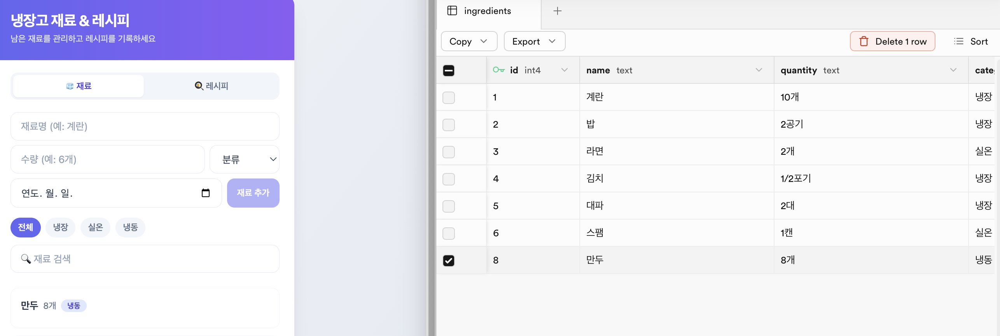
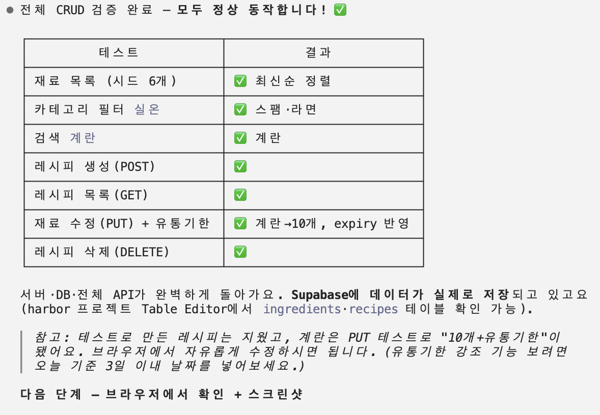

# 🧊 냉장고 재료 & 레시피 관리 앱

냉장고에 남은 재료를 관리하고, 그 재료로 만들 수 있는 레시피를 기록하는 풀스택 웹앱이다.
week_4 퀘스트 Q2 제출물.

## 개요

- **저장소**: Supabase PostgreSQL (재료/레시피 모두 DB에 영구 저장)
- **백엔드**: Node.js 내장 `http` 모듈 + `pg`(node-postgres) — 외부 프레임워크 없음
- **프론트**: React 18 + Tailwind CSS + Babel (CDN, 빌드 도구 없이 단일 `index.html`)
- **구조**: 같은 서버가 정적 파일(`index.html`)과 API(`/api/...`)를 함께 서빙 (same-origin)

### 주요 기능

- **재료 관리**: 이름·수량·카테고리(냉장/실온/냉동)·유통기한 등록, 검색, 카테고리 필터, 인라인 수정/삭제
- **유통기한 강조**: 오늘 기준 3일 이내는 빨강, 지난 것은 더 진한 빨강으로 표시
- **레시피 관리**: 제목·재료·조리법 작성, 제목·재료 검색, 인라인 수정/삭제
- **UX**: 검색 디바운스(300ms), 로딩/에러/빈상태 처리, 낙관적 업데이트(삭제)

## 실행 방법

```bash
# 1. 의존성 설치
npm install

# 2. 환경변수 설정
#    .env.example 을 복사해 .env 를 만들고 Supabase connection string 을 채운다
cp .env.example .env
#    .env 파일을 열어 DATABASE_URL 값을 입력
#    (Supabase 대시보드 > Project Settings > Database > Connection string)

# 3. 서버 실행
npm start
```

실행 후 브라우저에서 `http://localhost:3000` 접속.
서버 시작 시 테이블이 없으면 자동 생성하고, 재료가 0건이면 시드 데이터 6개를 입력한다.

> ⚠️ `.env` 파일은 git 에 올리지 않는다 (`.gitignore` 처리). 키 이름만 담긴 `.env.example` 만 공유한다.

## DB 스키마

### `ingredients` (재료)

| 컬럼 | 타입 | 설명 |
|---|---|---|
| `id` | SERIAL PK | 자동 증가 식별자 |
| `name` | TEXT NOT NULL | 재료명 (필수) |
| `quantity` | TEXT | 수량 (예: "6개", "1/2포기") |
| `category` | TEXT | 분류 (냉장/실온/냉동) |
| `expiry` | DATE | 유통기한 (없으면 null) |
| `created_at` | TIMESTAMPTZ | 등록 시각 (기본값 now()) |

### `recipes` (레시피)

| 컬럼 | 타입 | 설명 |
|---|---|---|
| `id` | SERIAL PK | 자동 증가 식별자 |
| `title` | TEXT NOT NULL | 레시피 제목 (필수) |
| `ingredients` | TEXT | 필요한 재료 (자유 텍스트) |
| `steps` | TEXT | 조리법 (자유 텍스트) |
| `created_at` | TIMESTAMPTZ | 등록 시각 (기본값 now()) |

### 시드 데이터 (재료가 0건일 때만 입력)

계란/6개/냉장, 밥/2공기/냉장, 라면/2개/실온, 김치/(1/2포기)/냉장, 대파/2대/냉장, 스팸/1캔/실온
(유통기한은 비움)

## API 엔드포인트

### 재료

| 메서드 | 경로 | 설명 |
|---|---|---|
| `GET` | `/api/ingredients?q=&category=` | 이름 검색(ILIKE) + 카테고리 필터, 최신순 |
| `POST` | `/api/ingredients` | 생성. body `{name, quantity, category, expiry}`. `name` 필수 |
| `PUT` | `/api/ingredients/:id` | 수정 |
| `DELETE` | `/api/ingredients/:id` | 삭제 |

### 레시피

| 메서드 | 경로 | 설명 |
|---|---|---|
| `GET` | `/api/recipes?q=` | 제목·재료 검색(ILIKE), 최신순 |
| `POST` | `/api/recipes` | 생성. body `{title, ingredients, steps}`. `title` 필수 |
| `PUT` | `/api/recipes/:id` | 수정 |
| `DELETE` | `/api/recipes/:id` | 삭제 |

- `:id` 는 숫자만 허용. 그 외 GET 요청은 `index.html` 정적 서빙.
- 상태코드: 생성 201 / 조회·수정·삭제 200 / 잘못된 요청 400 / 없음 404 / 서버 오류 500.
- 응답: 조회/생성/수정은 해당 행 객체(또는 배열), 삭제는 `{ ok: true }`, 오류는 `{ error: "..." }`.

## 파일 구성

```
02_recipe-manager/
├── server.js        # http + pg 서버 (CRUD API + 정적 서빙 + 테이블 자동생성/시드)
├── index.html       # React 단일 파일 (재료/레시피 탭 UI)
├── package.json     # 의존성(pg), start 스크립트
├── .env.example     # DATABASE_URL 키 템플릿 (값은 비움)
└── README.md        # 이 문서
```

## 스크린샷

### 앱 동작 + DB 저장
앱에서 재료(만두)를 추가하면 Supabase `ingredients` 테이블에 실제로 저장된다 (왼쪽 앱 / 오른쪽 Supabase Table Editor).



### 에이전트 활용 (CRUD 검증)
`single-server-specialist` 에이전트로 빌드하고, 전체 CRUD를 검증한 과정.



## 제출물 (마감: 금요일 23:59)

- [x] GitHub repo (코드 포함)
- [x] 동작 스크린샷
- [x] 에이전트 대화 스크린샷
- 포인트: 기본 10 + 에이전트 활용 5 + 창의성 5(검색·카테고리 필터·유통기한 강조) + 공유 5 = 올클리어 25
