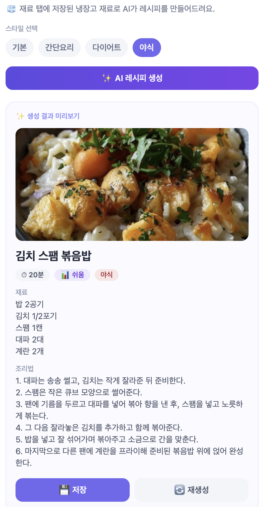
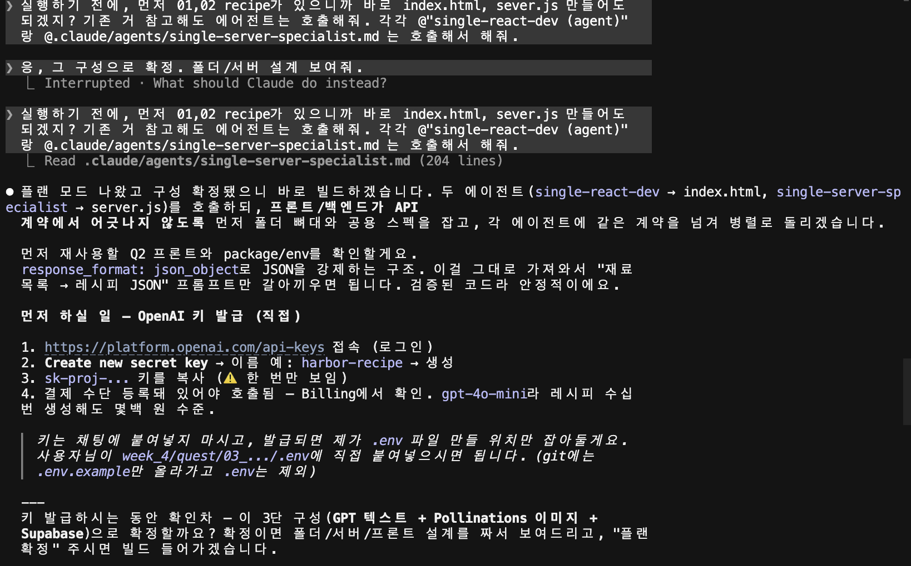

# 🤖 냉장고 재료 기반 AI 레시피 생성앱

냉장고에 저장된 재료를 바탕으로 **AI(OpenAI)가 레시피를 자동 생성**하고, 마음에 들면 DB에 저장하는 풀스택 웹앱이다.
week_4 퀘스트 Q3 제출물 (Server + DB + AI).

## 개요

- **AI**: OpenAI `gpt-4o-mini` — 재료 목록을 받아 레시피(제목·재료·조리법·조리시간·난이도)를 JSON으로 생성
- **저장소**: Supabase PostgreSQL — 재료(`harbor_w4_recipe_ingredients`) + AI 생성 레시피(`harbor_w4_recipe_recipes`) 영구 저장. **Q2와 같은 DB·테이블을 재활용**한다.
- **백엔드**: Node.js 내장 `http` 모듈 + `pg`(node-postgres) — 외부 프레임워크 없음
- **프론트**: React 18 + Tailwind CSS + Babel (CDN, 빌드 도구 없이 단일 `index.html`)
- **썸네일**: Pollinations(무료, API 키 불필요)로 레시피 이미지 자동 생성

### 데이터 흐름 (퀘스트 핵심)

```
[DB에서 재료 조회] → [Server: OpenAI API 호출] → [레시피 자동 생성]
    → [미리보기] → (사용자가 저장 선택) → [DB에 저장] → [레시피 목록에 표시]
```

- 프론트는 OpenAI를 직접 부르지 않는다. 서버가 **프록시**로 대신 호출해 API 키를 브라우저에 노출하지 않는다.
- AI가 생성한 결과는 곧바로 저장하지 않고 **미리보기**로 보여준 뒤, 사용자가 `저장` 또는 `재생성`을 선택한다.

### 주요 기능

- **재료 관리** (Q2 계승): 이름·수량·카테고리·유통기한 등록/검색/필터/수정/삭제
- **AI 레시피 생성**: 저장된 재료로 레시피 1개 생성. `기본 / 간단요리 / 다이어트 / 야식` 스타일 선택
- **미리보기 & 선택**: 썸네일·조리시간·난이도와 함께 미리보기 → `💾 저장` 또는 `🔄 재생성`
- **레시피 목록**: 저장된 레시피를 썸네일·메타 배지와 함께 조회/검색/수정/삭제

## 실행 방법

```bash
# 1. 의존성 설치
npm install

# 2. 환경변수 설정 (.env.example 복사 후 값 입력)
cp .env.example .env
#   DATABASE_URL   : Supabase connection string (Q2 .env 와 동일 값 재사용)
#   OPENAI_API_KEY : https://platform.openai.com/api-keys 에서 발급

# 3. 서버 실행
npm start
```

실행 후 브라우저에서 `http://localhost:3000` 접속.
서버 시작 시 테이블이 없으면 자동 생성하고, 재료가 0건이면 시드 6개를 입력한다.

> ⚠️ `.env` 는 git 에 올리지 않는다(`.gitignore` 처리). 키 이름만 담긴 `.env.example` 만 공유한다.

## DB 스키마

Q2의 `harbor_w4_recipe_ingredients` / `harbor_w4_recipe_recipes` 테이블을 그대로 재활용하고, `harbor_w4_recipe_recipes` 에 AI 메타 컬럼 4개를 `ALTER TABLE ... ADD COLUMN IF NOT EXISTS` 로 추가한다(기존 데이터 보존).

### `harbor_w4_recipe_ingredients` (재료) — Q2와 동일
| 컬럼 | 타입 | 설명 |
|---|---|---|
| `id` | SERIAL PK | 식별자 |
| `name` | TEXT NOT NULL | 재료명 |
| `quantity` | TEXT | 수량 |
| `category` | TEXT | 분류(냉장/실온/냉동) |
| `expiry` | DATE | 유통기한 |
| `created_at` | TIMESTAMPTZ | 등록 시각 |

### `harbor_w4_recipe_recipes` (레시피) — Q2 + AI 메타 컬럼
| 컬럼 | 타입 | 설명 |
|---|---|---|
| `id` | SERIAL PK | 식별자 |
| `title` | TEXT NOT NULL | 레시피 제목 |
| `ingredients` | TEXT | 필요한 재료 |
| `steps` | TEXT | 조리법 |
| `cook_time` | TEXT | **(추가)** 예상 조리시간 |
| `difficulty` | TEXT | **(추가)** 난이도(쉬움/보통/어려움) |
| `style` | TEXT | **(추가)** 생성 옵션(간단요리/다이어트/야식) |
| `thumbnail_url` | TEXT | **(추가)** Pollinations 썸네일 URL |
| `created_at` | TIMESTAMPTZ | 등록 시각 |

## API 엔드포인트

### 재료 (Q2 계승)
| 메서드 | 경로 | 설명 |
|---|---|---|
| `GET` | `/api/ingredients?q=&category=` | 검색 + 카테고리 필터, 최신순 |
| `POST` | `/api/ingredients` | 생성 (`name` 필수) |
| `PUT` | `/api/ingredients/:id` | 수정 |
| `DELETE` | `/api/ingredients/:id` | 삭제 |

### 레시피 (Q2 계승 + AI 컬럼)
| 메서드 | 경로 | 설명 |
|---|---|---|
| `GET` | `/api/recipes?q=` | 제목·재료 검색, 최신순 |
| `POST` | `/api/recipes` | 저장 (`title` 필수, AI 메타 컬럼 포함) |
| `PUT` | `/api/recipes/:id` | 수정 |
| `DELETE` | `/api/recipes/:id` | 삭제 |

### ⭐ AI 레시피 생성 (신규)
| 메서드 | 경로 | 설명 |
|---|---|---|
| `POST` | `/api/generate-recipe` | body `{ style }`. DB 재료 조회 → OpenAI 호출 → 레시피 JSON + 썸네일 URL 반환(**저장 안 함, 미리보기용**) |

- 재료 0건이면 400, `OPENAI_API_KEY` 없으면 500, OpenAI 오류면 502.
- 응답: `{ title, ingredients, steps, cook_time, difficulty, style, thumbnail_url }`

## 파일 구성

```
03_ai-recipe-generator/
├── server.js        # http + pg + OpenAI 프록시 (재료/레시피 CRUD + AI 생성 + 테이블 자동생성/시드)
├── index.html       # React 단일 파일 (재료 / ✨AI 레시피 / 레시피 3탭)
├── package.json     # 의존성(pg), start 스크립트
├── .env.example     # DATABASE_URL, OPENAI_API_KEY 키 템플릿
└── README.md        # 이 문서
```

## 만든 방법 (에이전트 활용)

- `server.js` — **single-server-specialist** 에이전트로 빌드. Q2 `server.js` 구조 + week_3 `about-me-app` 의 OpenAI 프록시(`callOpenAI`) 패턴을 계승.
- `index.html` — **single-react-dev** 에이전트로 빌드. Q2 `index.html` 디자인 시스템을 그대로 재사용하고 AI 탭만 신규 추가.

## 검증 (end-to-end)

- ✅ 서버 부팅 + Supabase 연결, `index.html` 정상 서빙
- ✅ 재료/레시피 CRUD, AI 메타 컬럼 저장·조회
- ✅ `POST /api/generate-recipe` → 실재료로 "김치 스팸 볶음밥" 실제 생성 (조리시간 10분·난이도 쉬움)
- ✅ Pollinations 썸네일 실제 이미지(JPEG) 반환

## 스크린샷

### 앱 동작 (AI 생성 → 저장 → DB)


### 에이전트 활용


## 제출물 (마감: 금요일 23:59)

- [x] GitHub repo (코드 포함)
- [x] 동작 스크린샷
- [x] 에이전트 대화 스크린샷
- 포인트: 기본 10 + 에이전트 활용 5 + 창의성 5(스타일 옵션·조리시간·난이도·미리보기/재생성·썸네일) + 공유 5 = 올클리어 25 목표
