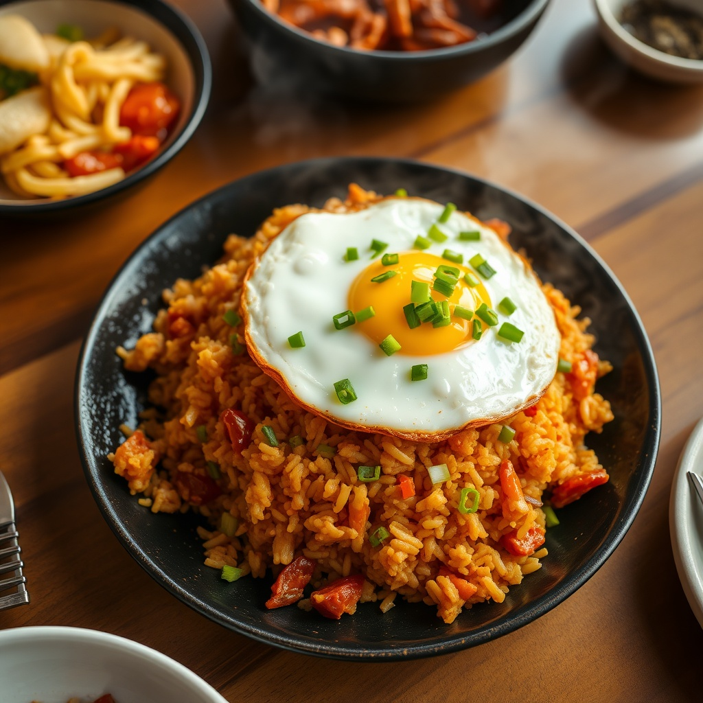

# 계란 김치볶음밥

> ⏱️ 조리시간: 12분 | 🍽️ 2인분 | 난이도: ⭐ 쉬움

## 📝 재료
- 밥 — 2공기 (찬밥이면 더 좋음)
- 김치 — 1컵 (잘게 썬 것)
- 계란 — 3개 (2개는 볶음밥용, 1개는 프라이용)
- 대파 — 1대 (송송)
- 식용유 — 2큰술
- 간장 — 1작은술
- 설탕 — 1/2작은술
- 후추 — 약간
- (선택) 김가루, 통깨 — 약간

## 👨‍🍳 만드는 법
1. 팬에 식용유 1큰술을 두르고 대파를 넣어 파기름을 낸다.
2. 잘게 썬 김치를 넣고 2~3분 볶다가 설탕 1/2작은술을 넣어 신맛을 잡는다.
3. 밥을 넣고 김치와 고루 섞어 볶은 뒤, 간장 1작은술을 팬 가장자리에 둘러 불맛을 낸다.
4. 계란 2개를 풀어 밥 위에 붓고 재빨리 섞어 계란이 밥에 코팅되게 볶는다. 후추로 마무리.
5. 남은 식용유 1큰술로 계란 프라이 1개를 반숙으로 부쳐, 볶음밥 위에 올리고 김가루·통깨를 뿌려 완성.

## 💡 꿀팁
- **설거지 최소화**: 볶음밥 팬 그대로 계란 프라이까지 부치면 팬 하나로 끝.
- **재료 대체**: 스팸이나 참치가 있으면 2단계에서 같이 넣으면 훨씬 든든하다.
- 반숙 프라이를 터뜨려 비벼 먹으면 김치의 매콤함이 부드러워진다.
- 찬밥이 고슬고슬해서 볶음밥엔 갓 지은 밥보다 낫다 — 냉장고 남은 밥 활용 추천.
