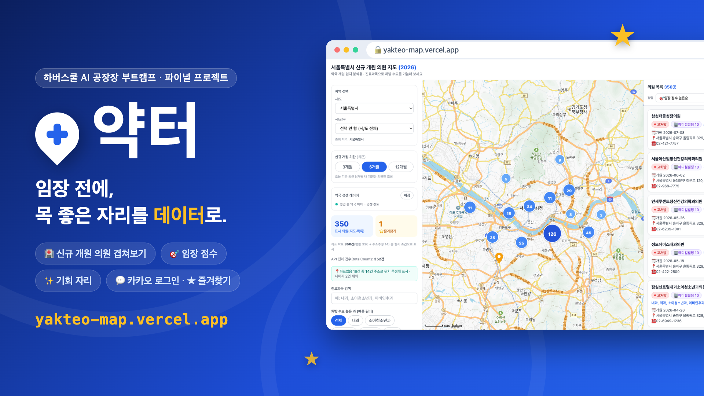

# 💊 약터 (Yakteo)



> **"약국 터 잡기"** — 처음 약국을 여는 약사가, 경쟁은 적고 처방 수요는 많은
> 유망 입지를 지도 위에서 데이터로 찾는 도구.

**🔗 배포 URL: https://yakteo-map.vercel.app**

## 🎬 데모 영상

▶️ [demo.mp4](assets/demo.mp4) (38초, 폰 화면녹화)

> 지역 선택(서울 종로구) → 신규 의원+약국 레이어 표시 → "기회 자리" 필터 →
> 임장 점수 Top 랭킹 확인 → ★ 즐겨찾기 저장

## 왜 만들었나

약국을 처음 개업하는 약사에게 "어디에 열 것인가"는 가장 큰 리스크이자 되돌리기 힘든
결정이다. 그런데 지금은 부동산 발품·지인 소개·지도앱을 손으로 훑는 방식뿐이라,
**경쟁 밀도(기존 약국)와 잠재 수요(신규 개원 의원)를 겹쳐 보는 객관적 판단**이 사실상
불가능하다. 약터는 공공데이터를 엮어 이 두 레이어를 한 지도에 얹고, 유망 후보를
점수로 랭킹해 "어디부터 봐야 할지"의 막막함을 없앤다.

자세한 기획 배경은 [MISSION.md](MISSION.md), 개발 계획은 [DEV.md](DEV.md) 참조.

## 핵심 기능 (v1)

| 기능 | 설명 | 상태 |
|---|---|---|
| **신규 개원 의원 + 경쟁 약국 겹쳐보기 지도** | 최근 N개월(기본 6개월) 신규 개원 의원과 기존 약국을 카카오맵에 함께 표시. 개원일 필터로 "새로 생기는 잠재 수요"를 골라낸다 | ✅ |
| **임장 점수 + 기회 자리** | 의원별 유망도를 `처방수요 + 약국공백 + 의사규모 + 메디컬빌딩` 4축으로 점수화·랭킹. 반경 내 약국이 없는 "기회 자리"는 금색 후광으로 강조 | ✅ |
| **필터·정렬** | 진료과 검색, 처방 수요 높은 과 빠른 필터, 의사수(규모) 필터, 임장점수·개원일·처방가중치 정렬 | ✅ |
| **카카오 로그인 + 즐겨찾기 서버 저장** | Supabase Auth(카카오)로 로그인하면 후보 입지가 점수·근거·좌표 스냅샷과 함께 서버에 저장 — 기기를 바꿔도 유지된다 | ✅ |
| 관심지역 지정 (당근마켓식) | 시군구 단위 최대 3곳·기본 1곳 지정 | 🔨 진행 중 |
| 후보 비교 뷰 | 즐겨찾기한 후보지를 나란히 비교 | ⬜ 예정 |

## 사용법

1. **지역 선택** — 시/도 → 시/군/구를 골라 자기 연고지·생활권을 지정한다
2. **임장 점수 확인** — 지도와 목록에서 신규 개원 의원의 유망도(점수·근거 분해)를 본다.
   금색 후광 = 반경 내 약국이 없는 "기회 자리"
3. **★ 즐겨찾기 저장** — 카카오 로그인 후 유망 후보를 저장한다
4. **재방문** — 다른 기기·다른 세션에서 로그인해도 저장한 후보가 그대로 유지된다
   → 임장(현장 방문) 다녀와서 다시 돌아와 재검토

## 기술 스택 · 아키텍처

```
브라우저 (index.html — React 18 CDN + Tailwind CDN, 빌드 도구 없음)
  ├─ 카카오맵 JS SDK ······· 지도 렌더링
  ├─ Supabase Auth ········· 카카오 로그인 (클라이언트에서 직접)
  └─ /api/* (Vercel 서버리스 함수)
       ├─ clinics · pharmacies · clinic-doctors ··· 공공데이터 프록시 (SERVICE_KEY 은닉)
       └─ favorites ······························· 즐겨찾기 CRUD (pg → Supabase Postgres)
```

- **프론트**: 단일 `index.html` — React 18(CDN) + Tailwind(CDN) + Babel standalone
- **백엔드**: Vercel 서버리스 함수(`api/*.js`) — 공공데이터 API 키를 서버 뒤로 숨기는 프록시
  + 즐겨찾기 CRUD. DB 접근은 서버만 하고(Supabase Data API OFF), 클라이언트는 Auth만 담당
- **DB/Auth**: Supabase — Postgres(`pg` 직접 연결) + Auth(카카오 provider)
- **데이터 출처**: 행정안전부 인허가 데이터(의원·약국), 건강보험심사평가원(의사수 보강) —
  모든 점수는 공공데이터 기반 **참고용** 지표다
- **배포**: Vercel (서울 리전 `icn1`)

## 로컬 실행

```bash
npm install                          # 의존성: pg 하나
cp .env.example .env                 # 없다면 아래 4개 키를 .env에 채운다
node scripts/check-env.mjs           # 환경변수 검증
npm start                            # http://localhost:3000
```

`.env` 필수 키 4개:

| 키 | 용도 |
|---|---|
| `SERVICE_KEY` | 공공데이터포털 API 키 (프록시가 사용) |
| `DATABASE_URL` | Supabase Postgres 연결 문자열 (즐겨찾기 저장) |
| `SUPABASE_URL` | Supabase 프로젝트 URL (Auth) |
| `SUPABASE_ANON_KEY` | Supabase anon 키 (Auth) |

DB 스키마는 `node scripts/migrate.mjs`로 생성한다(멱등 — 여러 번 실행해도 안전).

## 로드맵

- **v1 마무리**: 관심지역 지정(#4) → 후보 비교 뷰(#6) → 점수 신뢰도 표기(#7)
- **v2**: 신규 개원 예정 의료기관 **알림**(리텐션 1순위), 임장 체크리스트·현장 메모,
  동(洞) 단위 세밀화
- 비범위(하지 않는 것): 임대료·시세 분석, 매출 예측, 유료화 기능 — [MISSION.md](MISSION.md) 참조

## 회고

**잘된 점.** "기능 10개 반쪽보다 1개 완성"이라는 미션 취지에 맞춰, 핵심 기능
하나(카카오 로그인 + 즐겨찾기 서버 저장)를 배포까지 끝까지 밀어붙였다. 이미 완성돼
있던 프로토타입(지도·점수·필터) 위에 Auth·DB를 얹는 브라운필드 방식으로 접근해,
구조를 갈아엎지 않고도 로그인·서버 저장을 붙일 수 있었다. 특히 즐겨찾기를 처음부터
어댑터로 분리해 둔 덕에 localStorage 구현체를 서버 구현체로 "교체"만 하면 됐고,
DB 접근은 서버(서버리스 함수)만, 클라이언트는 Auth만 담당하도록 역할을 나눈 점이
안전하면서도 깔끔했다.

**아쉬운 점.** 계획했던 관심지역 지정(당근마켓식)과 후보 비교 뷰는 시간에 밀려 v1에
담지 못했다. 데모 영상에도 "다른 기기·세션에서 재로그인해도 즐겨찾기가 유지된다"는
서버 저장의 핵심 증명 컷을 넣지 못한 게 가장 아쉽다(기능 자체는 E2E로 검증 완료).
또 이 앱의 구조적 공백 — 임장(현장 방문) 실행 루프 — 은 v1에서 의도적으로 남겨두고
로그인·즐겨찾기로 최소한의 재방문 고리만 확보했다. 이 실행 루프와 "신규 개원 예정
의료기관 알림"이 v2의 1순위 과제다.

---

## 제출 정보 (하버스쿨 파이널 퀘스트)

| 제출물 | 위치 |
|---|---|
| 배포 URL (Vercel) | https://yakteo-map.vercel.app |
| 발표용 썸네일 (1920×1080) | [assets/thumbnail-1920x1080.png](assets/thumbnail-1920x1080.png) |
| 데모 영상 (38초) | [assets/demo.mp4](assets/demo.mp4) |
| 기획서 | [MISSION.md](MISSION.md) · [DEV.md](DEV.md) · [AUDIENCES.md](AUDIENCES.md) |
| 배포 소스 저장소 | `leehyeon12/yakteo` (Vercel 연결용, 이 폴더가 동일 코드의 제출 스냅샷) |
